~~~
                  ___ ___
                 /   |   \  ____  __ __  ______ ____
                /    ~    \/  _ \|  |  \/  ___// __ \
                \    Y    (  <_> )  |  /\___ \  ___/
                 \___|_  / \____/|____//____  >\___  >
                       \/      House        \/     \/
                
                    Dynamic Mobile Analysis Tool
                    Contact: hao.ke@nccgroup.com
~~~

## 
**House**: *A runtime mobile application analysis toolkit with a Web GUI,
powered by Frida, written in Python. It is designed for helping assess mobile
applications by implementing dynamic function hooking and intercepting and
intended to make Frida script writing as simple as possible.*

## TL;DR
~~~
git clone https://github.com/nccgroup/house
cd house
pip3 install -r requirements.txt
pip3 install pipenv
pipenv --python=/usr/bin/python3 install
pipenv --python=/usr/bin/python3 shell
python3 app.py <PORT>

# or:
mkvirtualenv --python=/usr/local/bin/python3 house
workon house
pip install -r requirements.txt
python app.py <PORT>

# or: (only for Mac OS)
git clone https://github.com/nccgroup/house
cd house
pip3 install -r requirements.txt
pip3 install pipenv
pipenv --python=/usr/local/bin/python3 install
pipenv --python=/usr/local/bin/python3 shell
python3 app.py <PORT>
~~~
By default, House binds to http://127.0.0.1:8000.

To get an overview of House capabilities, you can visit [user's manual](https://github.com/nccgroup/house/wiki/Overview) for details.

## News
- Added dynamic dex/jar hooking, House now can hook functions in dynamically loaded dex/jar files
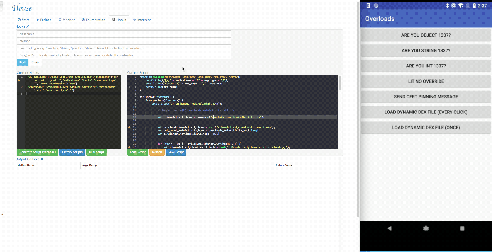
- Added Mini Script option for Hooks
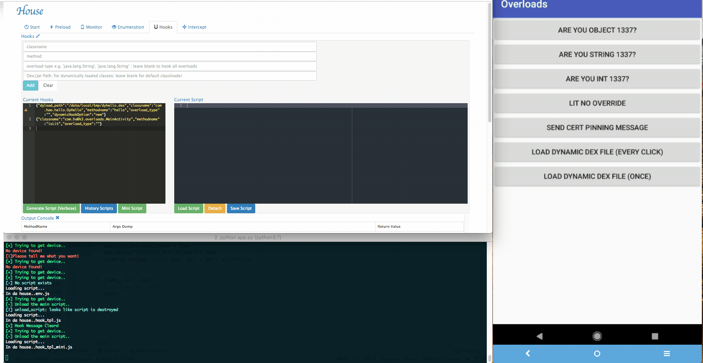
- ClassLoader Enum

**Note**: Make sure to update your Frida version to >= 12.8.3 for /dex/jar function hooking

## Example Usage

In this section, a small example is provided to illustrate basic usage of
House. The demo case is performed against a small testing android application:
[`com.ha0k3.overloads`](./test_apk/overloads.apk).

#### Start
- Make sure an Android device is plugged in over USB and Frida server is
running on the device. Check the Frida server is successfully spawned using the
following command: `frida-ps -U`.

- Start the House application by running app.py : `python app.py <PORT>`. 

- Open a browser and navigate to <http://127.0.0.1:PORT>.

- Observe the device information is displayed on the page, if not, click the
  `Refresh` button or restart the application and Frida server.
  	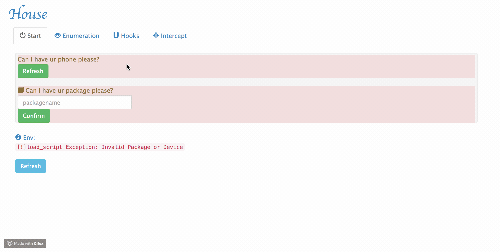
  	
#### Monitor
- Dynamically generating hook script from templates based on the [config file](https://github.com/nccgroup/house/blob/master/scripts/monitor/monitor_hook.json), monitor key operations including FILEIO, IPC, etc. 

- It is experimental at this point, If you find more functions needed to be hooked, feel free to let me know or file a PR.

#### Preload & Sideload
- House now support `sideload`. It supports stetho side loading at this point; which makes it easier for us to examine the UI; storage; etc.
    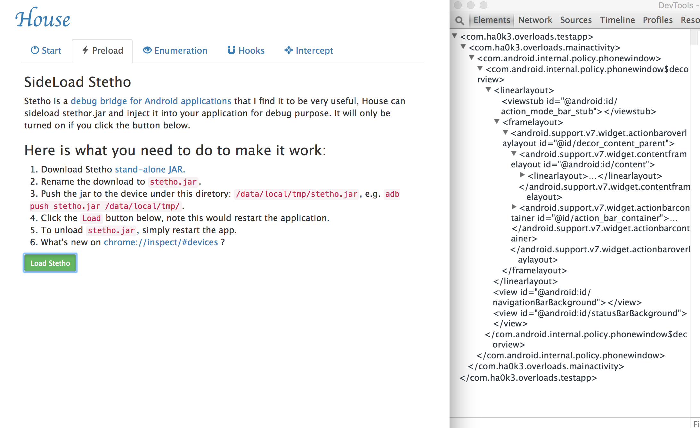
- It is experimental at this point, but more functionalities such as SSLStrip will be added under this tab.
    

#### Enumeration
- *Enumerate all loaded classes:*
	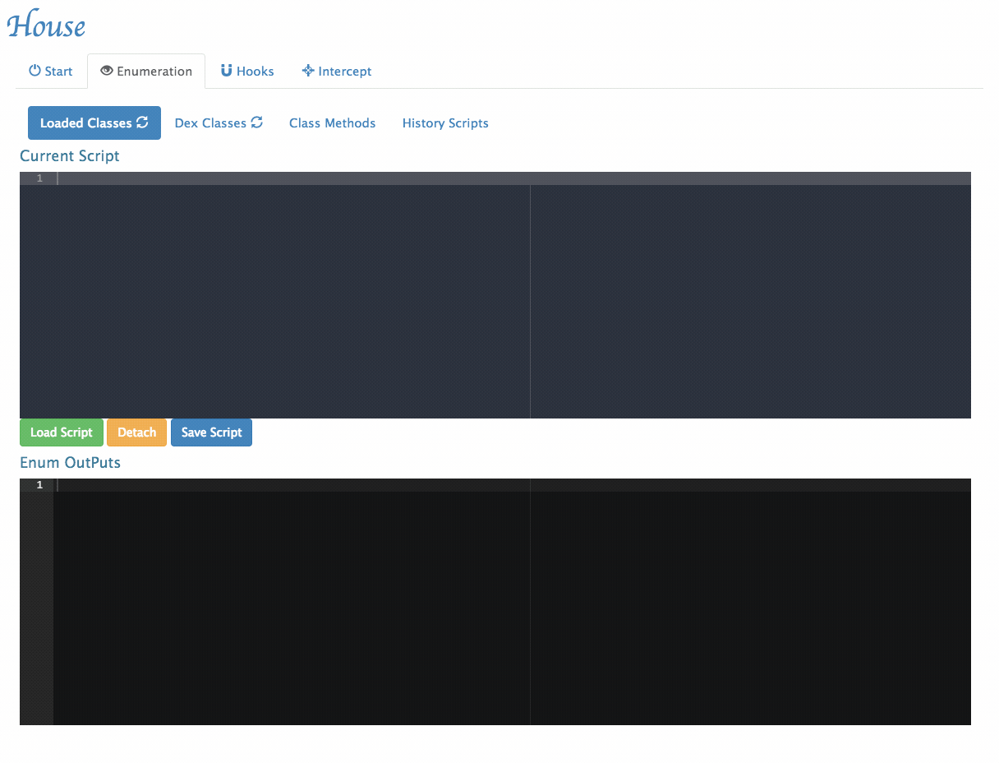
- *Enumerate all classes in the Dex file:*
	
- *Enumerates all methods within a given class*
	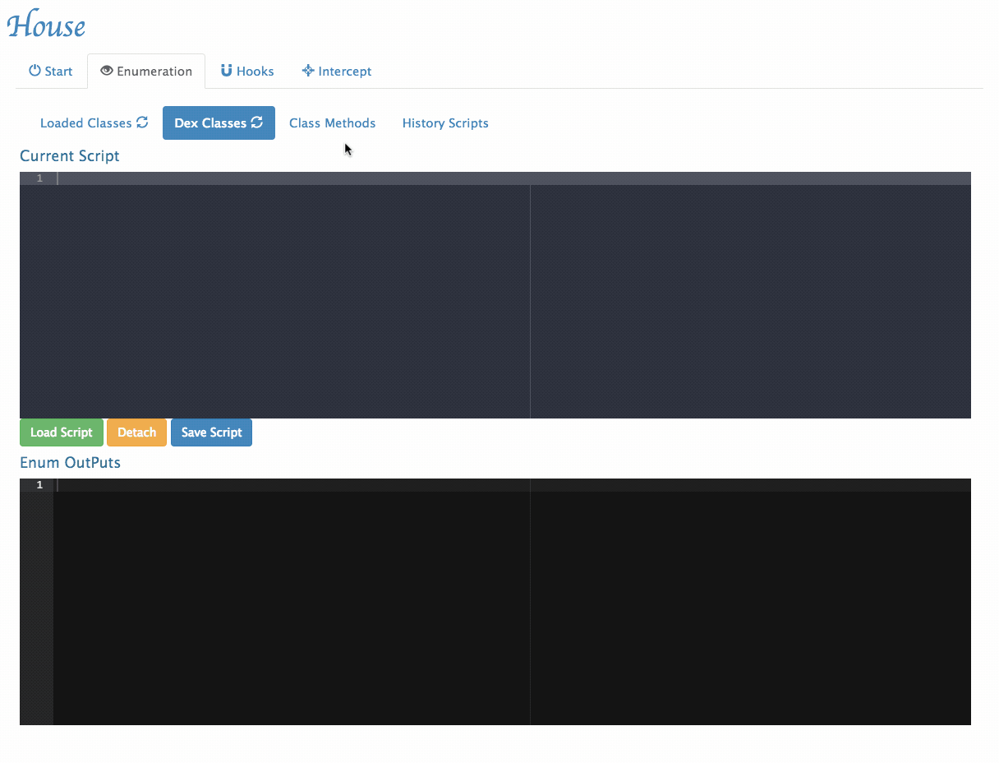
	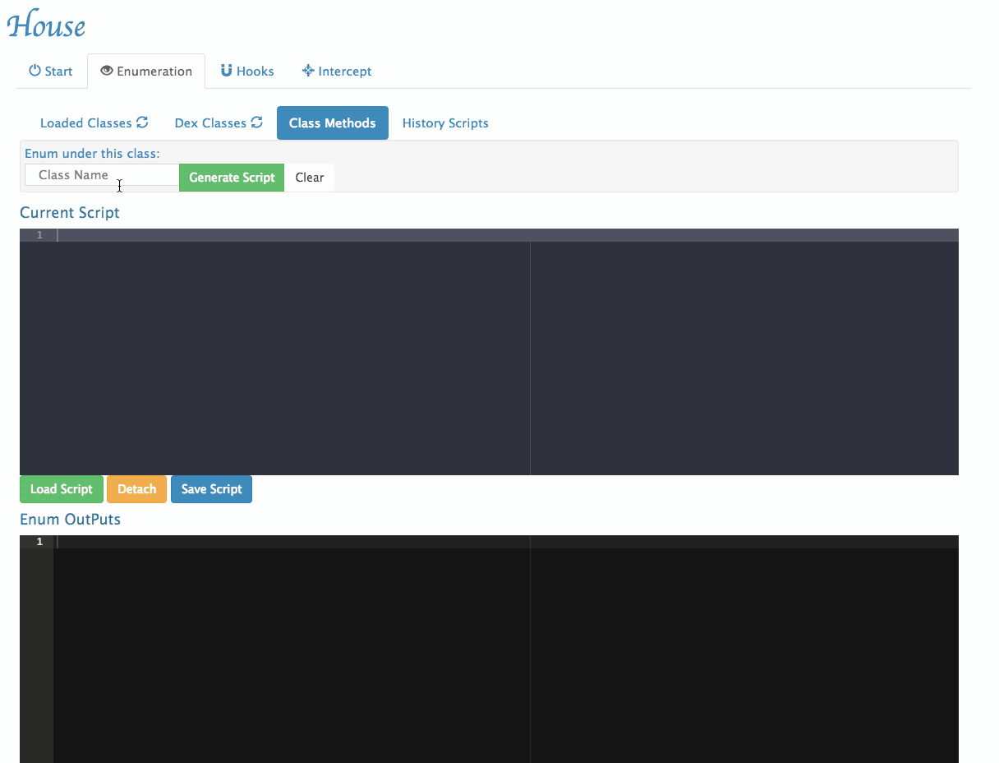
- *History Scripts management*
	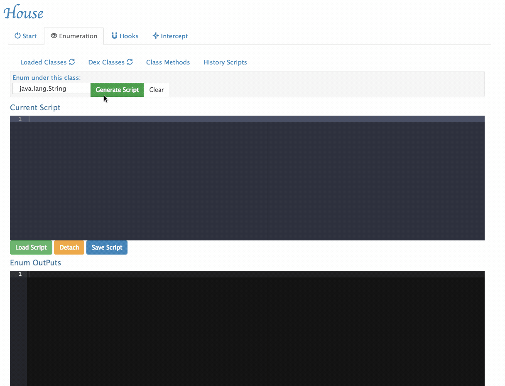
	
#### Multiple Function Tracing
- *Scripts rendering and Function Tracing*
	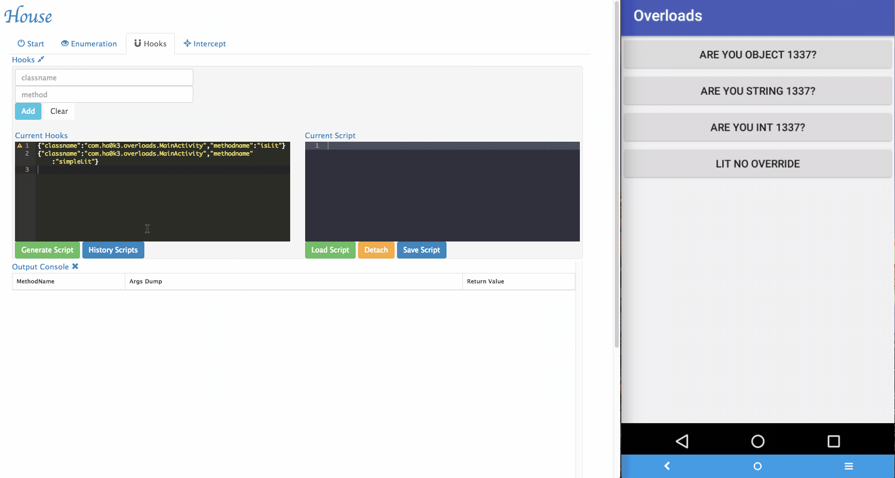
	
- *Hooks for functions in dynamically loaded dex/jar files*
	
	
- *Mini Script option*
	
	
- *History Scripts management*
	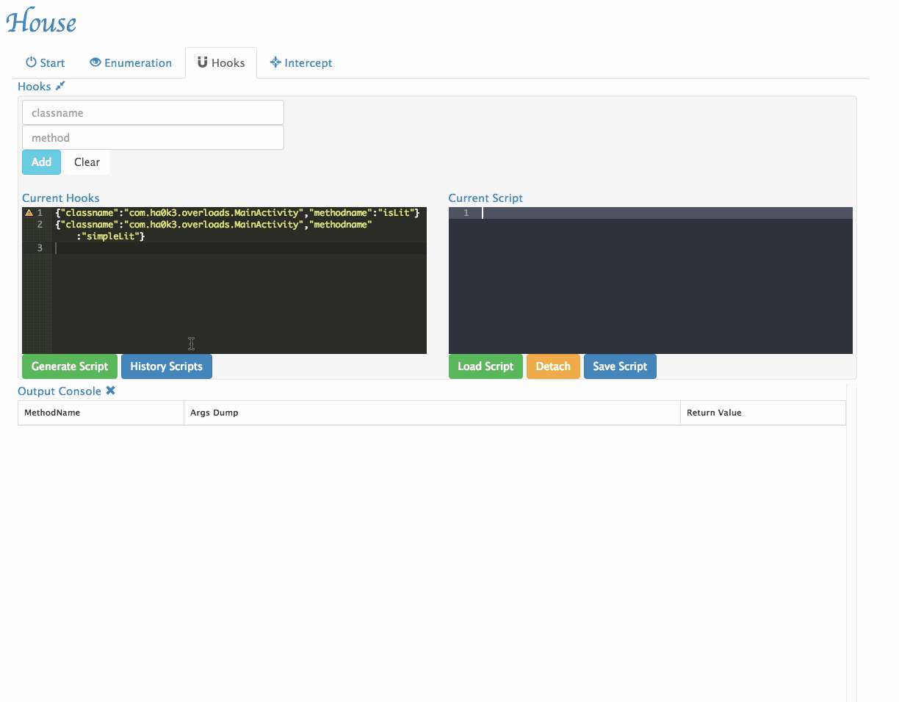
	
	
#### Function intercepting
- Via House, researchers can dynamically change the arguments being passed to
  the target functions and forward it.
	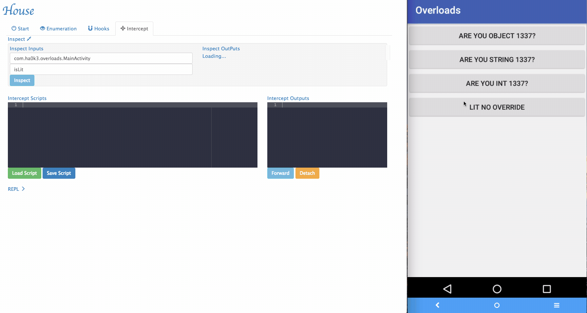

- Sometimes House cannot perfectly parse argument informations. For example, an
  arguments can be with special type. In the example app, it implemented
  `isLit` function that takes customized object as its argument. To tackle
  those situations, a simple "REPL" is provided by House. Security researchers
  can dynamically type in Frida script in the REPL and modify the function
  behaviors.
	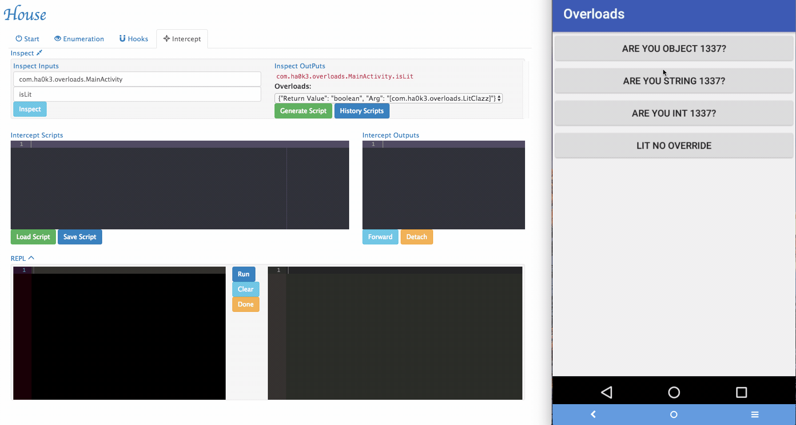
	
- Several REPL functions were provided by House to make the testing easier:
	- `inspectObject(obj)` uses `java.lang.reflect` to inspect fields information within an object.
	- `setRetval(ret)` takes a parameter and will try to cast it to the correct return type using the original return value's constructor.
    - `getStackTrace()` will print the stack trace.
	- More REPL functions will be added in the future.

	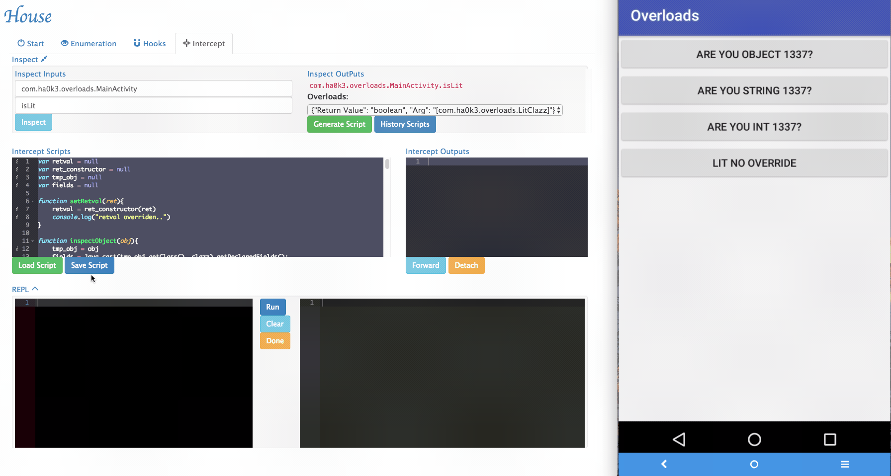

**Note:** For constructor method hooking/intercept, input `$init` as method name.

## FAQ 
#### Prerequisite:

To make House work; you would need:

1. A rooted android device with frida-server running plugged in your computer, use only one USB device is recommended.
2. Local frida-python version matches frida-server's.

#### Cannot get device? Does not work?
Also please try to restart **both** the frida server and House, if still not working, please file an issue.

#### Time out error?
Often occues when there are multiple USB devices connected, try to restart the target application.

#### Frida error?
House has been tested using Frida version 12.8.6; there might be some issues with some other versions, also make sure frida-python matches frida-server's version. If still not working, try to run the generated frida scripts manually to see if it works.

## Acknowledgements
Special thanks to following open-source projects for inspirations on House:

1. [Frida](https://frida.re/), the great instrumentation toolkit that making all of these possible.
2. [Objection](https://github.com/sensepost/objection), an inspiration and guide in building part of the Frida templating scripts of House.
3. [Inspeckage](https://github.com/ac-pm/Inspeckage), an inspiration on the **Monitor** functionality of House.
4. [0xdea/frida-scripts](https://github.com/0xdea/frida-scripts/tree/master/android-snippets) - a great Frida scripts arsenal.

## Contact
If you have more questions about House, or want to help extending it, feel free to contact:

[@haoOnBeat](https://twitter.com/haoOnBeat)

Or send an email to: [Hao Ke](mailto:hao.ke@nccgroup.com?Subject=House)

